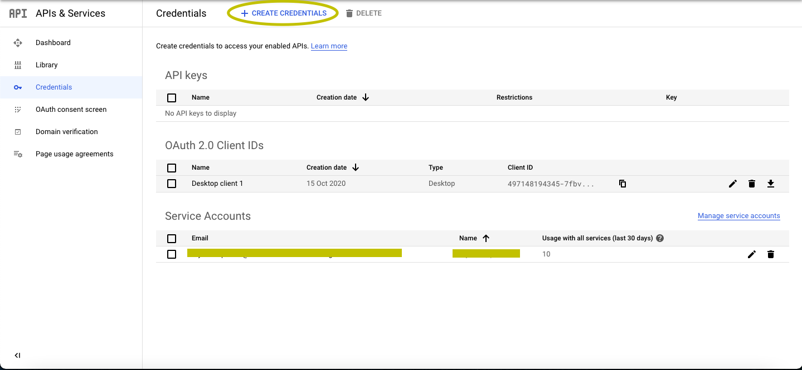
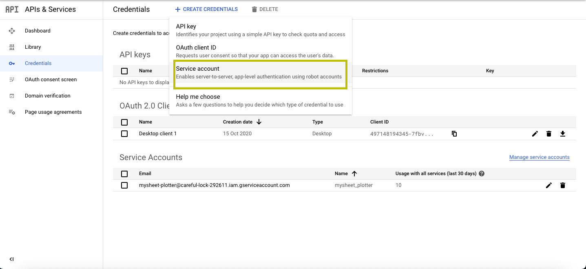
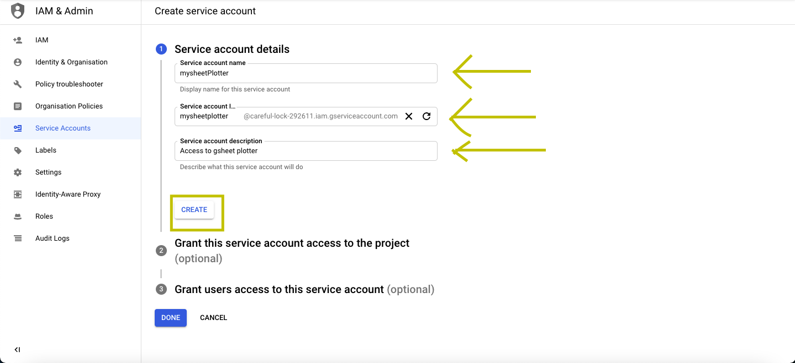
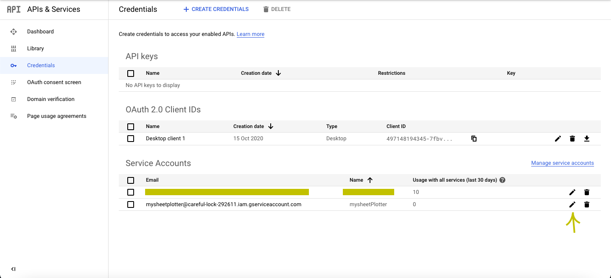
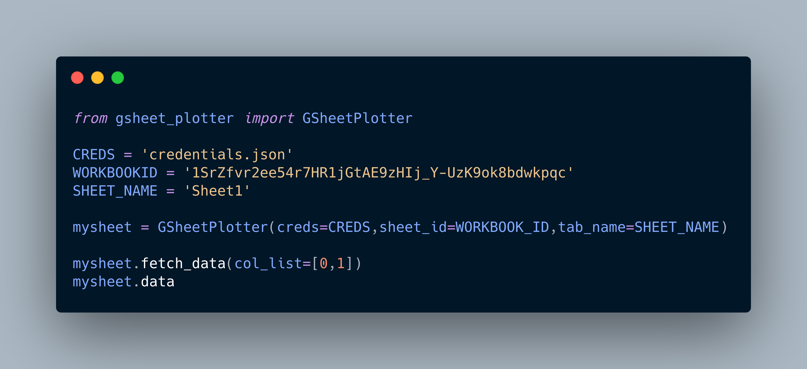
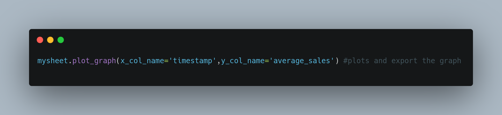
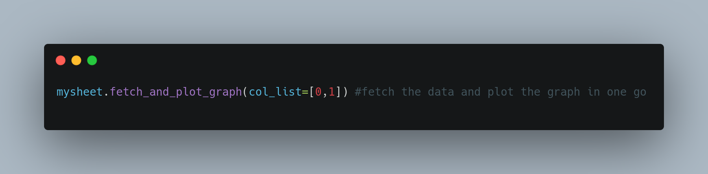
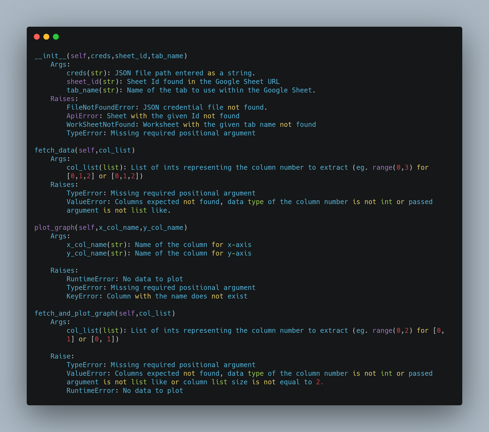

<h1 style="text-align:center;">GSheet Plotter</h1>

An interface to plot graphs using data from your Google Spreadsheets.

Features:

- Fetch spreadsheet from ID
- Plot 2D graphs using any two columns
- Export graphs in .png

---

# Quick Links to get up and running
- [Installation](#Installation)
- [Usage](#Usage)
- [Available Methods](#Available-methods)


# Installation:
## Install GSheet Plotter
```sh
pip install gsheet_plotter
```
---
## Download a credentials file(.json) to allow access to GSheet Plotter to access your spreadsheets.
- Go to (https://console.developers.google.com)[Google Developer Console] and login with your Google account.
- In the left pane click on ```Credentials```


- Click on ```Create Credentials```



- In the dropdown, choose ```Service Account```



- Fill in the details, and click on ```Create```



- Click on ```Done```

- Go back to your dashboard and you'll see new credentials added with the information you entered.

- Click on the <strong>Edit</strong> icon



- Goto <strong>Keys</strong> on ```Add Key```.

- Download the <strong>JSON</strong> file and move to the working directory.

---
# Usage:

  - Instantiate the class by passing Google Service Account json file,Sheet Id found in the Google Sheet URL and the work sheet name


  - Fetch data from the sheet to a pandas dataframe. The dataframe is saved in the ```data``` attribute.
  


  - Plot the graph by using two column names
 


  - Additional method- Fetch the data and plot the graph in one go by passing the column list 
 


---
# Available methods 




