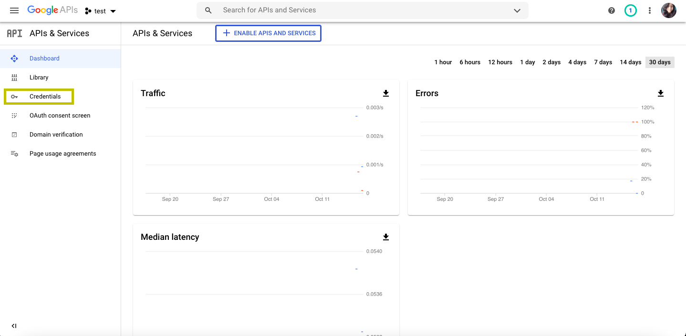

<h1 style="text-align:center;">GSheet Plotter</h1>

An interface to plot graphs using data from your Google Spreadsheets.

Features:

- Fetch spreadsheet from ID
- Plot 2D graphs using any two columns
- Export graphs in .png

---

Usage:
## Install GSheet Plotter

``` pip install gsheet_plotter```

## Download a credentials file(.json) to allow access to GSheet Plotter to access your spreadsheets.
- Go to (https://console.developers.google.com/)[Google Developer Console] and login with your Google account.
- In the left pane click on ```Credentials```

- Click on ```Create Credentials```

- In the dropdown, choose ```Service Account```

- Fill in the details, and click on ```Create```

- Click on ```Done``
- Go back to your dashboard and you'll see new credentials added with the information you entered.
- Click on the <strong>Edit</strong> icon

- Goto <strong>Keys</strong> on ```Add Key```.
- Download the <strong>JSON</strong> file and move to the working directory.


## Usage


